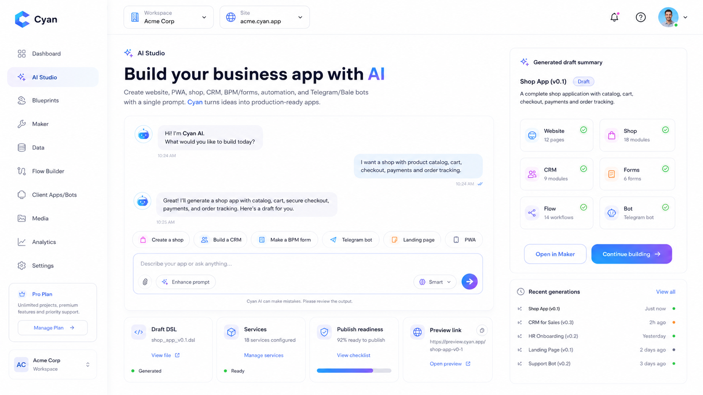
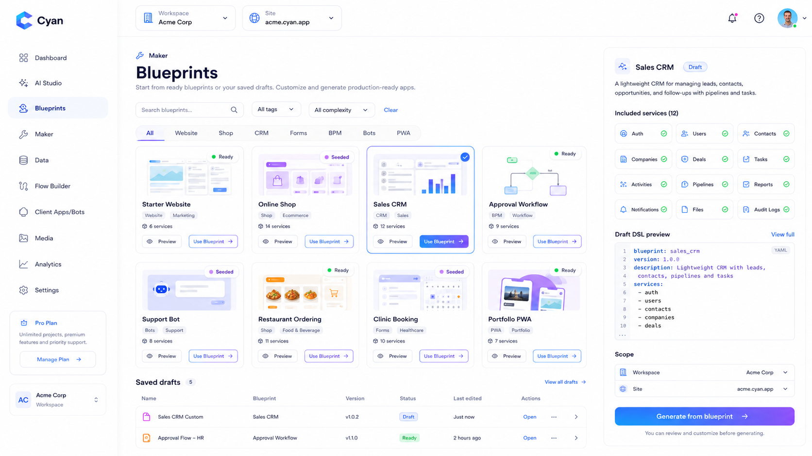
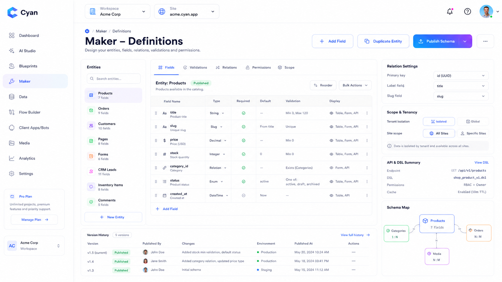
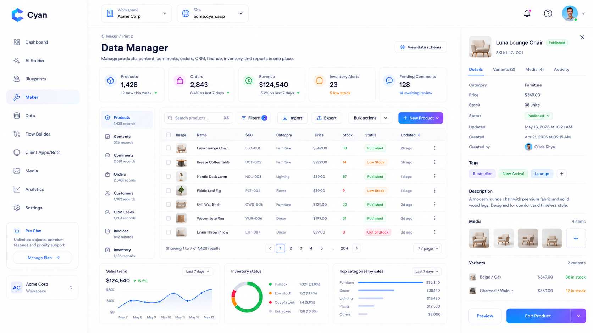
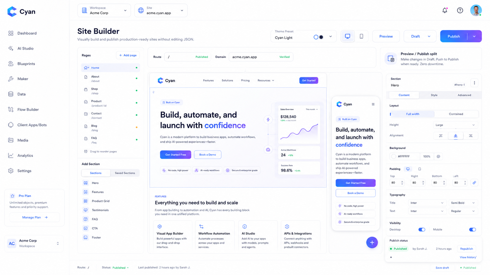
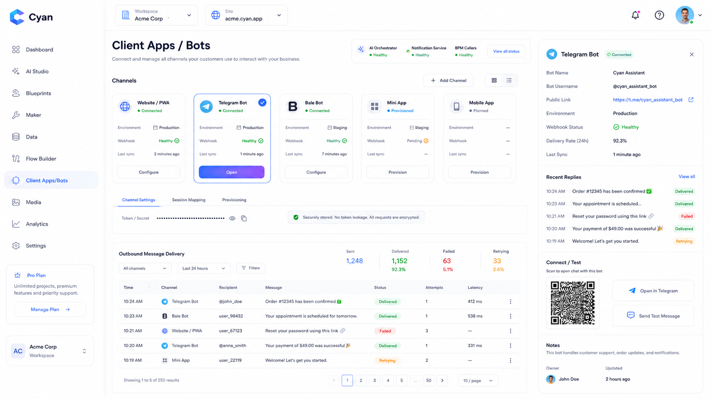
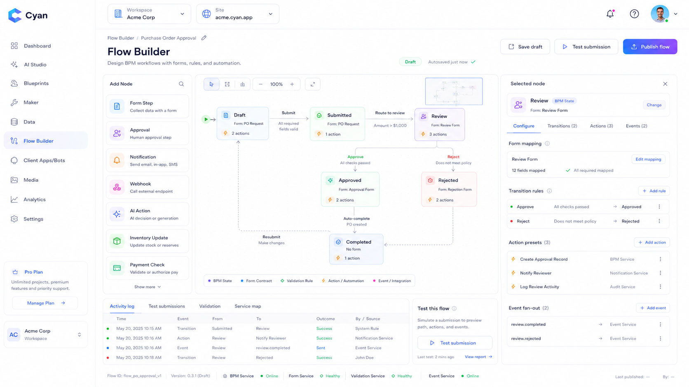
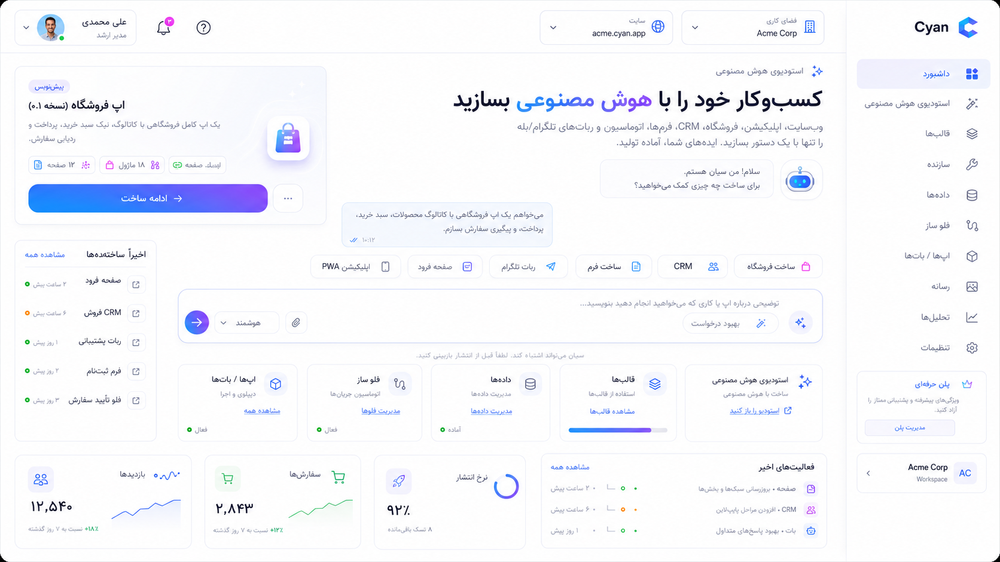

# Cyan Business Platform

Cyan is an AI-native modular business platform for companies that want to launch and operate a modern digital business from one stack.

It brings together:

- AI app generation
- website and PWA delivery
- commerce and checkout
- CRM and operational data
- BPM forms and approvals
- automation and notifications
- Telegram and Bale bot channels
- tenant/site-aware public experiences

## Why teams choose Cyan

- Build faster: go from prompt to draft app, data model, workflow, and delivery surface in one workspace.
- Stay structured: dynamic entity definitions keep records, forms, validations, and APIs aligned across services.
- Scale safely: the platform keeps tenant, site, internal API, and public API boundaries explicit.
- Ship more channels: launch web, shop, bot, and mini-app experiences from the same platform foundation.
- Automate operations: BPM, event fan-out, and automation services let teams move beyond manual back-office work.

## Product experience

### AI Studio



Use one structured prompt to generate a website, shop, CRM, forms, and bot-ready draft, then review the DSL, services, and publish readiness in one place.

### Blueprint catalog



Start from proven patterns for storefronts, CRM, workflows, support bots, booking flows, and PWAs instead of reinventing the same architecture per customer.

### Visual maker and data operations





Define entities, fields, relations, and permissions, then manage records, inventory, statuses, and operational detail from the same control surface.

### Site Builder and public delivery



Build, preview, and publish customer-facing routes with a route-aware builder that fits into the larger business stack rather than living as a disconnected CMS.

### Channels, bots, and workflows





Connect delivery channels, manage message health, simulate customer bot experiences, and orchestrate approvals and automation flows with BPM-backed runtime support.

### Multilingual experience



The panel is designed for multilingual teams, including RTL Farsi presentation with Vazir typography and a light-first default theme.

## What Cyan can power

- multi-tenant B2B SaaS workspaces
- commerce storefronts with cart, checkout, pricing, and payments
- CRM and service operations
- content and marketing sites
- workflow-heavy internal apps
- support and transaction bots on Telegram and Bale
- AI-assisted business provisioning for agencies and operators

## Core platform features

- `AI Studio`: prompt-to-draft generation through `ai-orchestrator-service`
- `Blueprints`: reusable service-backed app templates
- `Maker`: visual entity and schema design backed by `dynamic-entity-core`
- `Data Manager`: structured record operations across business services
- `Site Builder`: storefront route preview and publishing workflow
- `Flow Builder`: BPM state design, approvals, rules, and event fan-out
- `Client Apps / Bots`: Telegram, Bale, mini-app, and channel management
- `Search`: tenant-aware indexing and suggestion flows
- `Automation`: orchestration and execution tracking
- `IAM`: custom SSO realm, client, role, and membership management

## Platform architecture

The repository is organized around Spring Boot microservices and a Next.js panel:

- edge and infrastructure: `api-gateway`, `discovery-server`, SSO services
- dynamic business services: content, catalog, CRM, commerce, finance, inventory, storefront, media, cart, checkout, search, notification, BPM, AI orchestration
- automation and projections: event, automation orchestrator, report automation, finance automation, inventory automation, CRM automation
- operator panel: `panel-web`

Important architectural principles:

- dynamic definitions live in PostgreSQL
- records live in MongoDB for dynamic services
- tenant and site headers are first-class routing dimensions
- `/endpoint/**` is the authenticated public/operator API surface
- `/internal/**` is the service-to-service integration surface
- event fan-out goes through `event-service`

## Who this is for

- product teams building modular internal/external business apps
- agencies that need to launch customized client stacks repeatedly
- operations teams that want BPM, automation, and customer channels in one platform
- founders who need a commerce + CRM + content + workflow stack without stitching together many disconnected products

## Local development

Recommended reading order:

1. `LOCAL_PLATFORM_RUNBOOK.md`
2. `STRUCTURED_DYNAMIC_PLATFORM.md`
3. `BUSINESS_PLATFORM_SERVICES.md`
4. `BPM_SERVICE_ARCHITECTURE.md`
5. `KAFKA_AUTOMATION_ARCHITECTURE.md`

Run the panel:

```bash
cd panel-web
npm install
npm run dev
```

Build the panel:

```bash
cd panel-web
npm run build
```

## Current implementation notes

- the panel now follows the `UI-UX` references with a shared shell and light-default presentation
- Farsi mode is supported with local Vazir font assets
- the panel uses live microservice wiring where service contracts already exist
- current panel/API gaps are documented in [PANEL_UI_UX_ROADMAP.md](PANEL_UI_UX_ROADMAP.md)

## Repository guide

- `panel-web/`: multilingual operator panel
- `UI-UX/`: visual product references used for the panel redesign
- `docs/` and root architecture markdown files: platform design and rollout context
- service directories: business capabilities owned by each microservice

Cyan is built to help teams launch faster, operate with more structure, and unify public experience with real business execution. If you need one platform that can generate, model, publish, automate, and scale business apps, this repository is the foundation.
